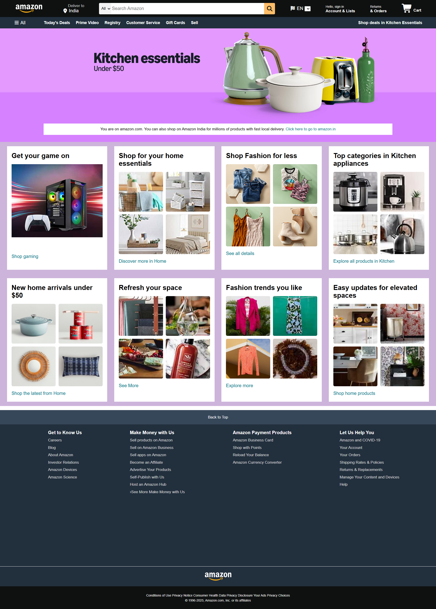

# Amazon Clone (HTML & CSS)

A clean **Amazon homepage clone** built using only **HTML5** and **CSS3**.  
This project is a practice exercise to strengthen frontend fundamentals such as semantic HTML, CSS layout techniques (Flexbox & Grid), and responsive design.

---

## Preview
  

---

## Features
-  Amazon-like **navigation bar**
-  Functional **search bar design**
-  Product grid layout with styled boxes
-  Reusable **card components**
-  Custom buttons, hover effects, and footer
-  Basic **responsive styling**
-  Built with **pure HTML & CSS** (no frameworks, no JS)

---

## Tech Stack
- **HTML5**
- **CSS3**

---

## Project Structure
amazon-clone/
│── index.html           # Main HTML file
│── style.css            # CSS stylesheet
│── images/              # Image assets
│── Amazon_Clone_ss.png  # Project screenshot (for README)
│── README.md            # Documentation

---

## 🔧 How to Run Locally
1. Clone this repository:
   ```bash
   git clone https://github.com/ReyanMishra/amazon-clone.git
   
2. Open the project folder:
   cd amazon-clone

3. Open index.html in your browser.
   
---

## Live Demo

You can view the project live here:  
👉 [Amazon Clone Live Demo](https://ReyanMishra.github.io/amazon-clone/)

---

## Learning Objectives

1. Build a real-world inspired layout with Flexbox & Grid
2. Use semantic HTML for clean structure
3. Apply CSS selectors, classes, and IDs effectively
4. Add hover states and UI polish
5. Practice responsive web design

---

## License

This project is intended for educational purposes only.
It is not affiliated with, endorsed, or sponsored by Amazon in any way.
